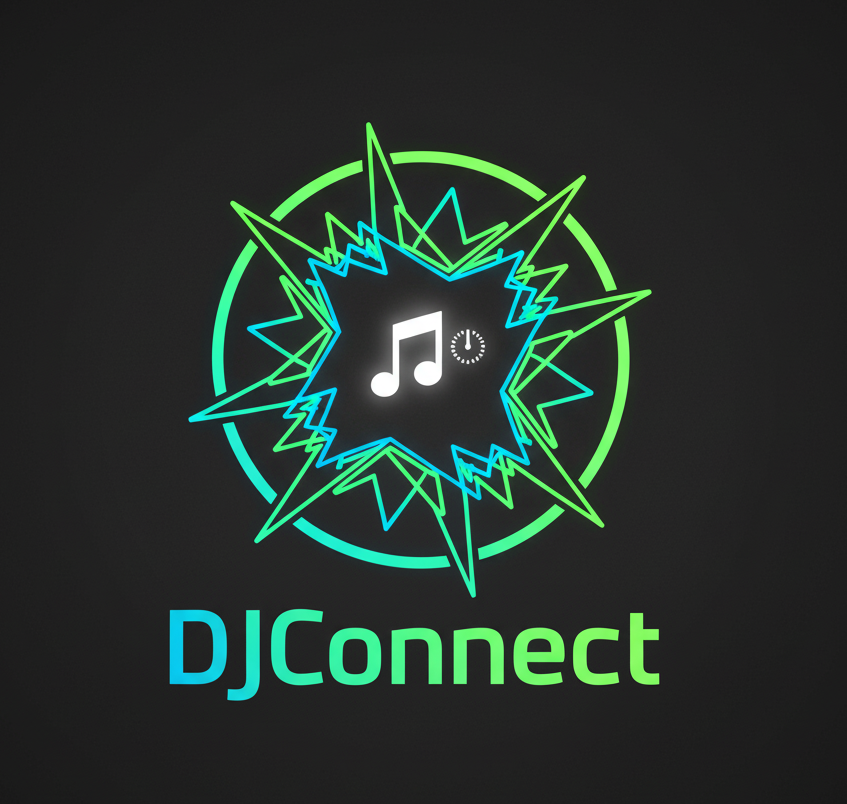

<p align="center">
  
</p>

<div align="center">
  <h1>🎵 DJConnect</h1>
  <p><strong>Plataforma web en tiempo real para la gestión interactiva de peticiones musicales en eventos en vivo</strong></p>
  <p>Optimizando la conexión entre el DJ y su audiencia</p>
</div>

<p align="center">
  
  
  
  
  
</p>

---

## 📋 Tabla de Contenidos

1.  [**Acerca del Proyecto y Funcionalidades**](#-acerca-del-proyecto-y-funcionalidades)
2.  [**Vistazo Rápido**](#-vistazo-rápido)
3.  [**Novedades v2.1**](#-novedades-v21)
4.  [**Stack Tecnológico**](#️-stack-tecnológico)
5.  [**Instalación y Documentación**](#-instalación-y-documentación)
6.  [**Hoja de Ruta**](#-hoja-de-ruta)
7.  [**Estructura del Directorio**](#-estructura-del-directorio)
8.  [**Contribuir**](#-contribuir)
9.  [**Licencia y Contacto**](#-licencia-y-contacto)

---

## 🚀 Acerca del Proyecto y Funcionalidades

**DJConnect** es una solución de software diseñada para digitalizar y simplificar la interacción entre los DJs y los asistentes a un evento. La aplicación elimina las barreras de la comunicación tradicional (peticiones verbales o en papel) al proporcionar una plataforma centralizada y en tiempo real.

| Módulo | Funcionalidad | Descripción |
| :--- | :--- | :--- |
| **🔐 Autenticación** | Gestión de Usuarios | Sistema de login con roles diferenciados (Admin/DJ). |
| **👨‍💼 Panel Admin** | Administración Completa | Control total de DJs, eventos, wishlists y configuración de la plataforma. |
| **🎉 Gestión de Eventos** | Multi-Fiesta y Salas Dinámicas | Creación de eventos con QR personalizados. DJs pueden gestionar hasta 3 fiestas simultáneas. |
| **🎛️ Panel del DJ** | Dashboard en Tiempo Real | Visualización de peticiones, estadísticas y gestión de cola (Socket.IO). |
| **📱 Interacción** | Sistema de Peticiones | Búsqueda en Spotify y envío de solicitudes desde cualquier móvil. |
| **📝 Wishlists** | Planificación Pre-Evento | Creación de listas de deseos compartibles (URL/QR) antes del evento. |
| **⭐ Valoraciones** | Ranking y Feedback | Sistema de puntuación y ranking de DJs para eventos. |
| **📊 Analytics** | Estadísticas Avanzadas | Géneros más pedidos, historial de fiestas y métricas de valoración. |
| **📸 Integración Social** | Perfil Instagram | Los DJs pueden vincular su Instagram visible en QR codes. |

---

## ✨ Vistazo Rápido

<p align="center">
  
</p>

---

## 🆕 Novedades v2.2

Esta versión introduce mejoras masivas en la administración, gestión de eventos múltiples, personalización, **Progressive Web App (PWA)** y **securización completa**.

### 👨‍💼 **Panel de Administración (¡Nuevo!)**
- **Gestión Centralizada**: Panel completo para administrar toda la plataforma.
- **Control de DJs**: Administra usuarios DJ, gestiona perfiles y contraseñas.
- **Gestión de Eventos**: Crea y asigna fiestas a DJs desde un único lugar.
- **Vista Global de Wishlists**: Acceso a todas las wishlists de la plataforma.
- **Estadísticas Globales**: Métricas del sistema (DJs totales, fiestas activas, wishlists).
- **Configuración de Marca**: Personaliza el logo de la plataforma visible en toda la aplicación.

### 🎉 **Multi-Fiesta para DJs (¡Nuevo!)**
- **Hasta 3 Fiestas Simultáneas**: Gestiona múltiples eventos activos al mismo tiempo.
- **Cambio Rápido**: Selector para cambiar entre eventos sin cerrar ninguno.
- **Gestión Independiente**: Cada fiesta mantiene su propia lista de peticiones y wishlists.

### 📸 **Integración Social y QR Mejorados (¡Nuevo!)**
- **Perfil de Instagram**: Los DJs pueden añadir su usuario de Instagram a su perfil.
- **QR Personalizados**: Códigos QR descargables con plantilla personalizada.
- **Branding Completo**: Los QR incluyen el logo de la plataforma y el Instagram del DJ.

### 📝 **Wishlists Pre-Evento**
- **Planificación Anticipada**: Crea wishlists *antes* de tus eventos.
- **Recopilación de Favoritas**: Los invitados sugieren canciones con antelación.
- **Gestión Completa**: Crea, comparte (URL/QR), abre/cierra y edita listas.
- **Exportación a PDF**: Descarga la lista completa para preparar tu set.
- **Separación Total**: Las wishlists no interfieren con las peticiones en vivo.

### 📊 **Sistema de Estadísticas Avanzado**
- **Géneros Musicales**: Integración con Spotify API para detectar géneros automáticamente.
- **Analytics en Tiempo Real**: Panel con género más pedido durante el evento.
- **Historial Completo**: Nueva sección con estadísticas de fiestas pasadas (total de canciones, género top, valoración media).

### 📱 **Diseño Responsive y UX Mejorado**
- **Mobile-First**: Diseño optimizado primero para dispositivos móviles.
- **Media Queries Completas**: Adaptación perfecta para smartphones y tablets.
- **Optimización Táctil**: Interfaces móviles y QR codes adaptables.
- **Centrado y Consistencia**: Diseño uniforme en todas las vistas.

### 🎵 **Gestión Mejorada de Peticiones**
- **Actualización en Tiempo Real**: Cambios instantáneos sin recargar la página (Socket.IO).
- **Ocultar canciones**: Elimina peticiones de la vista sin borrarlas.
- **Sin límites**: Solucionado bug de carga máxima de 100 peticiones.
- **Mejor scroll**: Lista optimizada para cientos de peticiones.

### 📱 **Progressive Web App (PWA) (¡Nuevo!)**
- **Instalable**: Instala DJConnect como app nativa desde el navegador.
- **Sin Tiendas**: No requiere App Store ni Google Play.
- **Actualizaciones Automáticas**: Sin aprobaciones ni delays.
- **Ícono en Pantalla de Inicio**: Como cualquier app nativa.
- **Experiencia Standalone**: Sin barra del navegador.
- **Compatible**: Android (Chrome) e iOS (Safari).

### 🔒 **Securización Completa (¡Nuevo!)**
- **Headers de Seguridad**: Helmet.js con CSP, HSTS, X-Frame-Options.
- **Rate Limiting**: Protección contra fuerza bruta y DDoS.
- **Validación de Inputs**: Sanitización completa con express-validator.
- **NoSQL Injection**: Protección contra inyecciones en MongoDB.
- **Subida de Archivos Segura**: Validación de magic numbers, tipos y tamaños.
- **JWT Cortos**: Tokens de 2 horas (reducido de 24h).
- **HTTPS Obligatorio**: Certificado SSL válido.

---

## 🛠️ Stack Tecnológico

| Capa | Tecnología | Propósito |
| :--- | :--- | :--- |
| **Backend** | **Node.js / Express** | API REST y lógica del servidor |
| **Base de Datos** | **MongoDB (Mongoose)** | Almacenamiento NoSQL persistente |
| **Tiempo Real** | **Socket.IO** | Comunicación bidireccional de baja latencia |
| **Frontend** | **HTML5, CSS3, Vanilla JS** | Interfaz sin dependencias de frameworks |
| **APIs Externas** | **Spotify API** | Catálogo de búsqueda de música y análisis de géneros |
| **Email** | **SendGrid** | Recuperación de contraseñas |

---

## 📚 Documentación

### Guías Disponibles

- **[PWA-GUIDE.md](./PWA-GUIDE.md)** - Guía completa de instalación de la Progressive Web App
- **[SECURITY.md](./SECURITY.md)** - Documento detallado de todas las medidas de seguridad implementadas
- **[Wiki oficial](https://github.com/tu-usuario/djconnect/wiki)** - Documentación completa de arquitectura y funcionalidades

### Instalación PWA

DJConnect puede instalarse como aplicación nativa en Android e iOS:

**Android:**
1. Abrir `https://djapp.duckdns.org` en Chrome
2. Menú (⋮) → "Instalar app"
3. ¡Listo!

**iOS:**
1. Abrir `https://djapp.duckdns.org` en Safari
2. Compartir 📤 → "Añadir a pantalla de inicio"
3. ¡Listo!

Consulta **[PWA-GUIDE.md](./PWA-GUIDE.md)** para más detalles.

---

## 🗺️ Hoja de Ruta

La hoja de ruta se centra en expandir la interactividad y la inteligencia de la plataforma.

### 🚧 v2.3 - En Desarrollo (Q2 2025)
- [ ] **Playlists Personalizadas**: Crear playlists basadas en peticiones.
- [ ] **Temas Personalizables**: Dark/Light mode y colores customizables.
- [ ] **Exportación de Datos Avanzada**: CSV con estadísticas detalladas.
- [ ] **Notificaciones Push**: Alertas para el DJ en nuevas peticiones.
- [ ] **Multi-idioma**: Soporte para inglés, portugués y francés.

### 🔮 v3.0 - Planificado (Q3 2025)
- [ ] **Integración con Apple Music**: Alternativa a Spotify.
- [ ] **Sistema de Votación**: Los invitados votan las canciones más deseadas.
- [ ] **Chat en Vivo**: Comunicación directa DJ-invitados.
- [ ] **Modo Karaoke**: Gestión de turnos para karaoke.

### 🌟 v4.0 - Visión Futura (2026)
- [ ] **App Móvil Nativa**: iOS y Android (probablemente React Native).
- [ ] **Integración con Hardware DJ**: Pioneer, Traktor, Serato.
- [ ] **Monetización para DJs**: Sistema de propinas digitales.
- [ ] **Analytics Predictivos**: IA para sugerir canciones y setlists.

### 💡 Ideas en Consideración
* Integración con sistemas de iluminación (Philips Hue).
* Modo "DJ Battle" para competencias.
* API pública para integraciones de terceros.

> **¿Tienes ideas?** ¡Abre un [Issue](https://github.com/tu-usuario/djconnect/issues) o [Discussion](https://github.com/tu-usuario/djconnect/discussions)!

---

## 📁 Estructura del Directorio

```sh
/
├── assets/                 # Recursos para el README (banners, gifs)
├── public/                 # Frontend estático (cliente)
│   ├── css/                # Hojas de estilo
│   ├── html/               # Vistas (login, paneles DJ/Admin, wishlists, etc.)
│   ├── js/                 # Lógica del cliente (sockets, config, UI)
│   ├── images/             # Imágenes de la app (logo, favicons)
│   └── index.html          # Página principal de peticiones
├── wiki/                   # Documentación del proyecto
├── djModel.js              # Modelo de datos DJ (Mongoose)
├── partyModel.js           # Modelo de datos Party (Mongoose)
├── wishlistModel.js        # Modelo de datos Wishlist (Mongoose)
├── configModel.js          # Modelo de configuración (Logo, etc.)
├── server.js               # Servidor Express + Lógica de Socket.IO
├── package.json            # Dependencias
└── README.md               # Este archivo
```
---

## 🤝 Contribuir

¡Las contribuciones son bienvenidas! Si deseas mejorar DJConnect, sigue estos pasos:

1.  **Fork** el proyecto.
2.  Crea una rama para tu feature (`git checkout -b feature/AmazingFeature`).
3.  **Commit** tus cambios (`git commit -m 'Add: Amazing Feature'`).
4.  **Push** a la rama (`git push origin feature/AmazingFeature`).
5.  Abre un **Pull Request**.

### 📝 Guías de Contribución
* Sigue el estilo de código existente.
* Escribe commits descriptivos.
* Documenta nuevas funcionalidades.
* Actualiza el `CHANGELOG.md` con tus cambios.

### 🐛 Reportar Bugs
Si encuentras un bug, por favor abre un **Issue** detallando:
* Descripción del problema.
* Pasos para reproducirlo.
* Comportamiento esperado vs. actual.
* Screenshots (si es aplicable).

---

## 📄 Licencia y Contacto

### Licencia
Este proyecto se distribuye bajo una licencia propietaria. Consulta el archivo `LICENSE.md` para más detalles.

### Agradecimientos
* **Spotify Web API** por su increíble catálogo musical.
* **Socket.IO** por hacer posible la comunicación en tiempo real.
* A todos los DJs que han probado y aportado feedback.

### Contacto
* **Soporte / Email**: `alvaropavonmartinez7@gmail.com`
* **Bugs / Issues**: [GitHub Issues](https://github.com/tu-usuario/djconnect/issues)
* **Ideas / Dudas**: [GitHub Discussions](https://github.com/tu-usuario/djconnect/discussions)
* **Documentación**: [Project Wiki](https://github.com/tu-usuario/djconnect/wiki)

<br>
<div align="center">
  <p>Hecho con ❤️ para la comunidad de DJs</p>
  <p>⭐ ¡Si te gusta DJConnect, dale una estrella en GitHub! ⭐</p>
</div>
